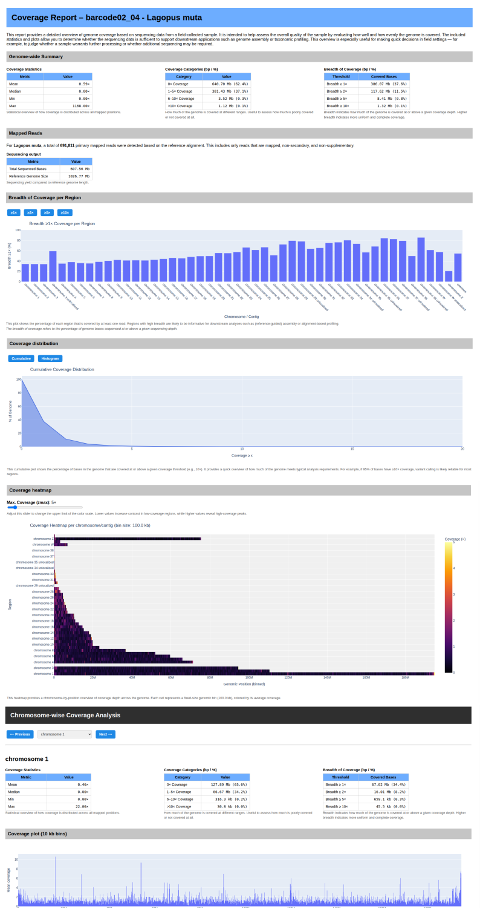

# Zugspitze - Metagenomics Project 🧬❄️

## 🧪 Project Overview

This project provides a complete analysis pipeline for metagenomic ONT data collected as part of environmental and wildlife monitoring in the Zugspitze region.

The goal is to use the `epi2me-labs/wf-metagenomics` workflow to specifically detect and quantify the presence of species such as the **rock ptarmigan (*Lagopus muta*)**, **black grouse (*Lyrurus tetrix*)**, or **mountain hare (*Lepus timidus*)**.

Depending on the objective, two workflow options are available:

- **Minimap2 Workflow**  
  Targeted species identification using custom reference genomes. Enables alignment-based classification and detailed coverage analysis.

- **Kraken2 Workflow**  
  Broad taxonomic classification against a comprehensive prebuilt database (e.g., PlusPFP-16), suitable for identifying **bacteria, viruses, fungi, protozoa, plants**, and **vertebrates**.

For deeper quality control, a dedicated Python script `genome_coverage.py` is available (Minimap2 only), which generates interactive HTML reports with:

- detailed **coverage statistics**
- interactive **chromosomal plots and heatmaps**
- region-wise navigation and visual quality assessment

---

## 📄 Documentation

Based on the official **EPI2ME workflows** by Oxford Nanopore:

- [Workflow documentation](https://epi2me.nanoporetech.com/epi2me-docs/workflows/wf-metagenomics/)
- [Using custom reference genomes](https://epi2me.nanoporetech.com/how-to-meta-offline/)

---

## 🧬 Reference Genomes

| Organism                       | Taxonomy ID | Assembly | Level      |
|--------------------------------|-------------|----------|------------|
| *Lepus timidus* (mountain hare) | 62621       | [GCA_040893245.2](https://www.ncbi.nlm.nih.gov/datasets/genome/GCA_040893245.2/) | Chromosome |
| *Lyrurus tetrix* (black grouse) | 1233216     | [GCA_043882375.1](https://www.ncbi.nlm.nih.gov/datasets/genome/GCA_043882375.1/) | Scaffold   |
| *Lagopus muta* (rock ptarmigan) | 64668       | [GCF_023343835.1](https://www.ncbi.nlm.nih.gov/datasets/genome/GCF_023343835.1/) | Chromosome |

> ⚠️ **Note:** Reference genomes should be regularly checked for updates.  
> *Lyrurus tetrix* is currently only available at scaffold level (contigs only).

---

## 📦 Dependencies

| Tool / Package | Purpose |
|----------------|---------|
| `nextflow`     | Workflow execution |
| `docker`       | Runs EPI2ME containers |
| `kraken2`      | Broad taxonomic classification |
| `minimap2`     | Reference alignment (Minimap2 workflow) |
| `mosdepth`     | Coverage calculation per BAM file |
| `pysam`        | BAM processing in Python |
| `pandas`       | Data analysis |
| `plotly`       | Interactive charting |
| `seqkit`       | FASTA/FASTQ manipulation (optional) |

> Most tools are installed in the Conda environment `zugspitze_metagenome`.

---

## ⚙️ Installation

```bash
# Create Conda environment
mamba create -n zugspitze_metagenome \
  -c conda-forge -c bioconda \
  nextflow seqkit kraken2 pysam pandas plotly mosdepth \
  --yes

mamba activate zugspitze_metagenome

# Install and enable Docker
sudo apt install docker.io
sudo systemctl enable --now docker
sudo usermod -aG docker $USER
newgrp docker  # ensures group change takes effect without logout/login

# Test the EPI2ME workflow installation
nextflow run epi2me-labs/wf-metagenomics --help
```
---

## 🧬 Preparation of Reference Genomes

> ⚠️ This step is **only required for the Minimap2 workflow**.  
> For the Kraken2 workflow, prebuilt databases are used (see [📦 Kraken2 Database Setup](#-kraken2-database-setup)).

Download the reference genomes for rock ptarmigan (*Lagopus muta*), black grouse (*Lyrurus tetrix*), and mountain hare (*Lepus timidus*), merge them, and create a Minimap2 index:

```bash
mkdir -p referenceGenome/{Lepus_timidus,Lagopus_muta,Lyrurus_tetrix,combined_genomes,taxdump}

# Download genomes
wget -P referenceGenome/Lepus_timidus https://ftp.ncbi.nlm.nih.gov/genomes/all/GCA/040/893/245/GCA_040893245.2_mLepTim1.1_pri/GCA_040893245.2_mLepTim1.1_pri_genomic.fna.gz
wget -P referenceGenome/Lagopus_muta https://ftp.ncbi.nlm.nih.gov/genomes/all/GCF/023/343/835/GCF_023343835.1_bLagMut1_primary/GCF_023343835.1_bLagMut1_primary_genomic.fna.gz
wget -P referenceGenome/Lyrurus_tetrix https://ftp.ncbi.nlm.nih.gov/genomes/all/GCA/043/882/375/GCA_043882375.1_ASM4388237v1/GCA_043882375.1_ASM4388237v1_genomic.fna.gz

# Merge genomes
cat referenceGenome/Lepus_timidus/*.gz \
    referenceGenome/Lagopus_muta/*.gz \
    referenceGenome/Lyrurus_tetrix/*.gz \
    > referenceGenome/combined_genomes/LeTim_LagMut_LyrTet.genome.fasta.gz

# Create Minimap2 index
minimap2 -t 8 -x map-ont -d referenceGenome/combined_genomes/LeTim_LagMut_LyrTet.genome.mmi \
    referenceGenome/combined_genomes/LeTim_LagMut_LyrTet.genome.fasta.gz

# Download NCBI taxonomy
wget -P referenceGenome/taxdump https://ftp.ncbi.nlm.nih.gov/pub/taxonomy/new_taxdump/new_taxdump.tar.gz
```

---

## 📄 Create `ref2taxid` File

The `ref2taxid` file links each FASTA sequence header to its NCBI taxonomy ID and is required for Minimap2-based classification.

```bash
cd referenceGenome/combined_genomes

# Lepus timidus (TaxID: 62621)
zgrep "^>" ../Lepus_timidus/*.fna.gz | cut -d' ' -f1 | sed 's/^>//' | awk '{print $0 "\t62621"}' > lepus.tsv

# Lagopus muta (TaxID: 64668)
zgrep "^>" ../Lagopus_muta/*.fna.gz | cut -d' ' -f1 | sed 's/^>//' | awk '{print $0 "\t64668"}' > lagopus.tsv

# Lyrurus tetrix (TaxID: 1233216)
zgrep "^>" ../Lyrurus_tetrix/*.fna.gz | cut -d' ' -f1 | sed 's/^>//' | awk '{print $0 "\t1233216"}' > lyrurus.tsv

# Combine all entries
cat lepus.tsv lagopus.tsv lyrurus.tsv > ref2taxid.targloci.tsv
```

---

## 🧭 Mapping File for Coverage Analysis

> 🐍 This file is required only for use with the Python script [`genome_coverage.py`](./genome_coverage.py),  
> which generates interactive HTML coverage reports for each species based on BAM and BED input.

To generate coverage plots, each reference sequence (FASTA header) must be linked to:
- the corresponding species name (e.g., *Lagopus muta*)
- a region label (e.g., chromosome or contig name)

### Example line

```text
NC_064433.1    Lagopus muta    chromosome_1
```

A ready-to-use script is available at [`scripts/generate_mapping.sh`](./scripts/generate_mapping.sh).  
It processes all three reference genomes and produces the final mapping file at:


```text
referenceGenome/mappings/combined_mapping.tsv
```

### Running the Script

Execute the mapping script from within the `referenceGenome` directory:

```bash
cd referenceGenome
chmod +x generate_mapping.sh
./generate_mapping.sh
```
This file is required as --mapping input for genome_coverage.py.

## 🚀 EPI2ME Workflow with Minimap2

Once all reference files (genome, index, taxonomy, `ref2taxid`, mapping) have been prepared, the metagenomics analysis with Minimap2 can be started.

> ⚠️ Note:  
> The Minimap2 workflow can **only detect species** whose genomes were downloaded and indexed beforehand in [🧬 Reference Genome Preparation](#-reference-genomes).  
> In this project, these are:
> - *Lagopus muta* (rock ptarmigan)
> - *Lepus timidus* (mountain hare)
> - *Lyrurus tetrix* (black grouse)

The following is a **basic manual execution example** using Nextflow.  
▶️ **For a fully automated version, see:** [🧪 Automated Analysis with Minimap2](#-automated-analysis-with-minimap2)

```bash
nextflow run epi2me-labs/wf-metagenomics \
  --fastq /pfad/zur/fastq_pass/ \
  --classifier minimap2 \
  --reference referenceGenome/combined_genomes/LeTim_LagMut_LyrTet.genome.mmi \
  --ref2taxid referenceGenome/combined_genomes/ref2taxid.targloci.tsv \
  --taxonomy referenceGenome/taxdump/new_taxdump.tar.gz \
  --out_dir zugspitze_output \
  --keep_bam
```

### Parameter Description

- `--fastq`  
  Path to the directory containing demultiplexed ONT reads, e.g., `fastq_pass/`

- `--classifier minimap2`  
  Specifies Minimap2 as the classifier (instead of, e.g., Kraken2)

- `--reference`  
  Minimap2 index file (`.mmi`) of the combined reference genomes

- `--ref2taxid`  
  TSV file mapping each sequence ID (e.g., `NC_...`) to an NCBI Taxonomy ID

- `--taxonomy`  
  Compressed taxonomy archive (`new_taxdump.tar.gz`) from NCBI

- `--out_dir`  
  Output directory for all results (reports, classifications, BAM files)

- `--keep_bam`  
  Keeps the aligned BAM files (required for downstream coverage analysis)

---

## 🧪 Automated Analysis with Minimap2

For a fully automated execution of the Minimap2-based metagenomics workflow including coverage analysis, use the Bash script [`run_metagenome_minimap2.sh`](./scripts/run_metagenome_minimap2.sh).

### Usage

```bash
./run_metagenome_minimap2.sh <FASTQ_INPUT_FOLDER> <OUTPUT_DIR> <SPECIES> [BIN_SIZE]
```

### Example

```bash
./run_metagenome_minimap2.sh \
  20250626_1607_2F_PBE33297_9035ed7a/fastq_pass/ \
  zugspitze_analysis \
  "Lagopus muta" \
  1000
```

### Arguments

- `FASTQ_INPUT_FOLDER`  
  Path to the folder containing ONT FASTQ files, typically the `fastq_pass/` directory of a sequencing run.

- `OUTPUT_DIR`  
  Name or path of the output directory where all results will be stored.

- `SPECIES`  
  **Required.** One of the following species (must be provided in quotes):  
  - `"Lagopus muta"`  
  - `"Lepus timidus"`  
  - `"Lyrurus tetrix"`

- `BIN_SIZE` *(optional)*  
  Bin size (in base pairs) used for coverage calculation (e.g., `1000` for 1kb).  
  If not specified, the default is `1000`.
- 
---

## 📦 Kraken2 Database Setup

For Kraken2-based analysis, a prebuilt classification database is required.  
The official Kraken2 databases are ready-to-use and can be downloaded directly.

> 🔗 Source: [https://benlangmead.github.io/aws-indexes/k2](https://benlangmead.github.io/aws-indexes/k2)

### Choosing the Appropriate Database Size

The choice depends on the available system memory:

- **PlusPFP-16** (`~14.9GB`)  
  Recommended for ≥16–32GB RAM  
  Includes:  
  - RefSeq Archaea, Bacteria, Viruses, Plasmids  
  - Human, UniVec_Core  
  - **Plus**: RefSeq Protozoa, Fungi, and Plants

- **PlusPFP-8** (`~7.5GB`)  
  Recommended for systems with 8GB RAM  
  Same structure as PlusPFP-16, but reduced in size

> 💻 *Note:* In this project, `PlusPFP-16` was successfully used on a laptop with 32GB RAM.

---

### Download of PlusPFP-16

```bash
mkdir -p referenceGenome/kraken2_db/k2_pluspf_16gb
cd referenceGenome/kraken2_db/k2_pluspf_16gb

wget https://genome-idx.s3.amazonaws.com/kraken/k2_pluspf_16gb_20250402.tar.gz
tar -xf k2_pluspf_16gb_20250402.tar.gz
```

---

## 🚀 Kraken2-Based Analysis

Once the Kraken2 database and the NCBI taxonomy archive have been set up, the workflow can be executed with Kraken2 as the classifier.

### Example: Manual Execution

The following example shows a **basic manual run** using Nextflow.  
▶️ **For a fully automated version, see:** [🧪 Automated Workflow with Kraken2](#-automated-workflow-with-kraken2)

```bash
nextflow run epi2me-labs/wf-metagenomics \
  --fastq /data/20250626_DNA_Test_Schneehuhn/20250626_DNA_Test_Schneehuhn/20250626_1607_2F_PBE33297_9035ed7a/fastq_pass/ \
  --database referenceGenome/kraken2_db/k2_pluspf_16gb/ \
  --taxonomy referenceGenome/kraken2_db/taxonomy/ \
  --out_dir zugspitze_kraken2
```

### Parameter Description

- `--fastq`  
  Path to the directory containing demultiplexed ONT FASTQ files (e.g., `fastq_pass/`)

- `--database`  
  Path to the unpacked Kraken2 database (e.g., `referenceGenome/kraken2_db/k2_pluspf_16gb/`)

- `--taxonomy`  
  Path to the directory containing the unpacked NCBI taxonomy files (from `new_taxdump.tar.gz`)

- `--out_dir`  
  Output directory where the analysis results will be stored (e.g., `zugspitze_kraken2`)

---

## 🧪 Automated Workflow with Kraken2

To automate the Kraken2-based analysis, use the script [`run_metagenome_kraken2.sh`](./scripts/run_metagenome_kraken2.sh).  
This script invokes the Nextflow workflow with predefined paths to the Kraken2 database and taxonomy archive.

### Usage

```bash
./run_metagenome_kraken2.sh <FASTQ_INPUT_FOLDER> <OUTPUT_DIR>
```

### Arguments

- `FASTQ_INPUT_FOLDER`  
  Path to the directory containing ONT FASTQ files, typically `fastq_pass/`

- `OUTPUT_DIR`  
  Directory where the results will be saved (created if it doesn't exist)

### Notes

- The script uses predefined paths for the Kraken2 database and taxonomy archive. Make sure they exist and are correctly set:

```bash
KRAKEN2_DB="referenceGenome/kraken2_db/k2_pluspf_16gb/"
TAXONOMY="referenceGenome/kraken2_db/taxonomy/"
  ```
  
---

## 📂 Example Outputs

The [`examples/`](./examples/) folder contains sample HTML reports generated as part of this project.  
They demonstrate typical output from each workflow and the analysis scripts.

> ⚠️ **Note:**  
> GitHub does not render `.html` files directly in the browser.  
> To view the interactive reports properly, download the file and open it locally in your browser.

The files are grouped by workflow:

### 🔬 Minimap2 Workflow

| Filename | Description |
|----------|-------------|
| [`wf-metagenomics-report_minimap2.html`](./examples/wf-metagenomics-report_minimap2.html) | Summary of the EPI2ME workflow using Minimap2 (classified against custom reference genomes) |
| [`coverage_report_Lagopus_muta_10kb.html`](./examples/coverage_report_Lagopus_muta_10kb.html) | Detailed coverage report for *Lagopus muta* with 10kb binning, generated using `genome_coverage.py` |

### 🌍 Kraken2 Workflow

| Filename | Description |
|----------|-------------|
| [`wf-metagenomics-report_kraken2.html`](./examples/wf-metagenomics-report_kraken2.html) | Summary of the EPI2ME workflow using the Kraken2 database (broad classification across many taxa) |

---

## 🖼️ Preview of Analysis Results

The following screenshots provide examples of how the generated HTML reports appear in the browser.  
They are based on files in the [`examples/`](./examples/) folder and offer a quick visual overview of layout, interactivity, and analysis depth.

### 🔬 Minimap2 + Coverage Analysis

**Workflow output with Minimap2 (Nextflow / EPI2ME):**


**Coverage report for *Lagopus muta*** (`genome_coverage.py` with 10kb binning):



---

### 🌍 Kraken2 Results

**Workflow output with Kraken2 (Nextflow / EPI2ME):**

